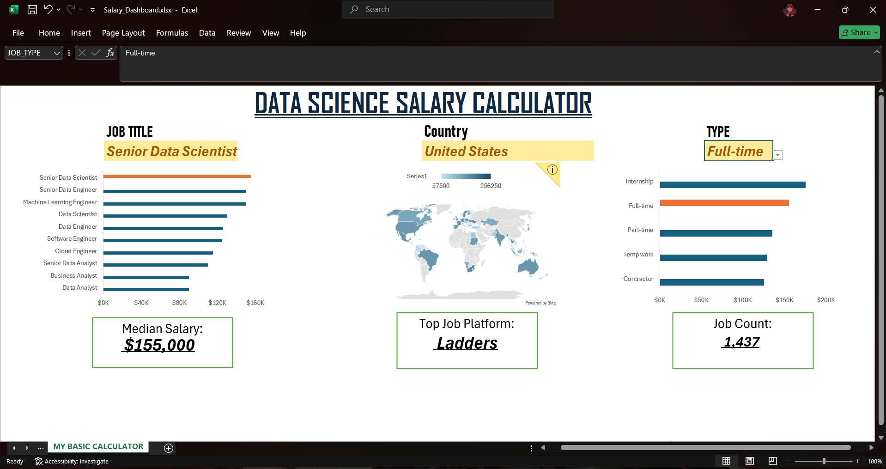

# Data Science Salary & Executive Dashboard

## 📊 Project Overview
This business intelligence application was constructed to visualize global data science payroll metrics. The dashboard transforms raw operational salary data into a highly scannable, executive-level layout designed to optimize decision-making.

## 🖼️ Dashboard Preview

## 🛠️ Core Features & Technical Skills Applied
* **Executive Aesthetic:** Engineered a custom high-visibility dark header banner, eliminated default gridlines, and applied targeted accent color mapping to highlight data insights cleanly.
* **Dynamic Interactivity:** Implemented dynamic KPI summary cards capturing **Median Salary**, **Top Job Platforms**, and **Total Job Counts**.
* **Segmented Analytics:** Constructed robust data validation arrays enabling seamless regional filtering by Job Title, Country, and Employment Type.
* **Optimized Charts:** Built professional horizontal bar visualizations and geographic data mapping with custom data labels to display complex data at a glance.

## 📁 Files Included
* `Data_Science_Salary_Dashboard.xlsx` - Fully interactive, functional core spreadsheet application.

## 🧠 Credits & Framework
Architecture designed using foundational data visualization principles studied from industry expert **Luke Barousse**.
